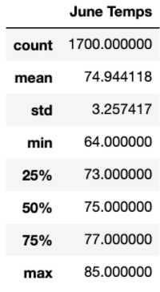
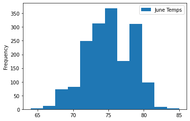
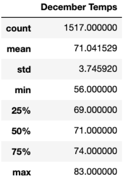
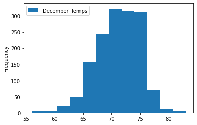

# Surfs_Up

## Overview
The purpose of this analysis is to review the temperature trends for June and December on the island of Oahu to determine year-round sustainablity of the proposed surf and ice-cream shop.  

## Results

- The mean temperature, standard deviation and maximum temperatures for both June and December are very similar
- The key difference between the temperature trends for June and December is distribution of around the mean.  
  
  

- June's minimum temperature trends over 10 degrees higher than in December. The colder minimum temperature and lower quartile could indicate a potenital for decreased demand during the winter months.    

## Summary

An initial analysis of temperature trends shows a promising year-round sustainablity based on a temperate climate.  Additional queries to evaluate precipitation trends and an expansion of monthly temperature trends would lend a more robust analysis.  
